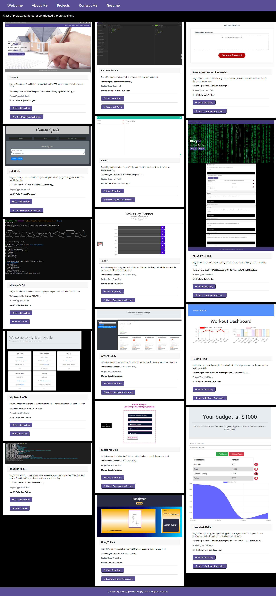

# Mark Forester's Portfolio.

## Contents

• [Description](#description)
• [Technologies](#technologies)
• [Links](#links)
• [Questions](#questions)

## Description

This web application is written in React.  
It showcases my work, my roles on the projects that I participated in, my contact information and a link to my resume.

### Technologies

I am quite proficient in using the following technologies:

• React  
• HTML5  
• CSS  
• JavaScript  
• JQuery  
• Bootstrap  
• NodeJS  
• MySQL  
• NoSQL  
• MongoDB  
• IndexedDB  
• PWA  
• MVC Architecture  
• MERN Stack

## Links

### Link to the Deployed Webpage

[Mark Forester's Portfolio Deployed Webpage](https://Forester93.github.io/MarkForesterReact/)

### Link to the Github Repository

[Mark Forester's Portfolio Github Repo](https://github.com/Forester93/MarkForesterReact/)

### Screenshot of the Application

## Questions

You can reach out to me over one of the following for any questions about this application.

| Name          | Email                    | Phone Number        | GitHubProfile                                                  |
| ------------- | ------------------------ | ------------------- | -------------------------------------------------------------- |
| Mark Forester | markforester93@gmail.com | +61-(0)-404-831-362 | [Mark Forester Github Profile](https://github.com/Forester93/) |
